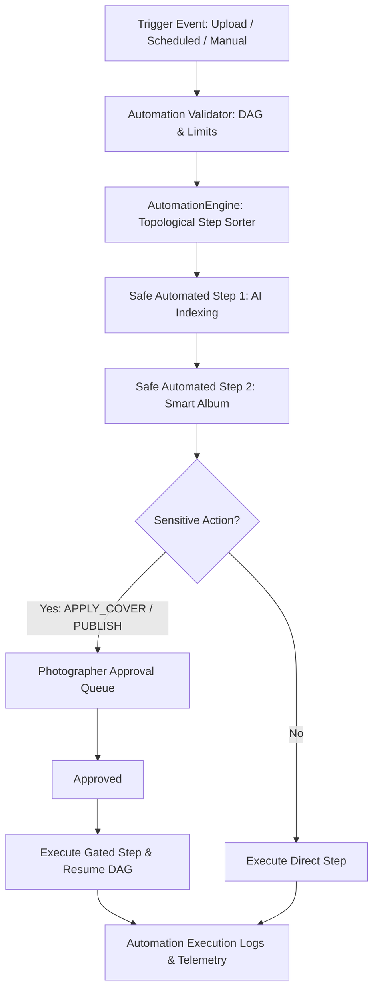

# Phase 16: AI Studio Automation & Gallery Workflow Orchestrator

## 1. Architecture Overview

Phase 16 delivers an enterprise-grade workflow orchestration engine for PixMatch AI. Photographers can design and trigger Directed Acyclic Graph (DAG) automation workflows that coordinate AI processing, quality filtering, album generation, cover selection, and delivery actions across their galleries.

---

## 2. Core Concepts & Safety Model

### 2.1 DAG Dependency Graph & Validation
- **Directed Acyclic Graphs**: Steps define dependencies using `depends_on: [step_id]`.
- **Validation Rules**:
  - Max **50 steps** per workflow.
  - Complete cycle detection via Depth-First Search (DFS).
  - Validation against self-referential dependencies and non-existent parent step IDs.
  - Step ID uniqueness within each workflow definition.

### 2.2 Explicit Approval Queue
Sensitive and destructive actions are automatically intercepted and routed to the studio's **Approvals Queue** (`AutomationApproval` model), halting the workflow in `WAITING_APPROVAL` status until a studio photographer approves or rejects:
- `APPLY_COVER`
- `DELETE_PHOTOS`
- `PUBLISH_GALLERY`
- `SEND_CLIENT_EMAIL`
- `CHANGE_VISIBILITY`
- `CHANGE_GALLERY_SETTINGS`

### 2.3 Resiliency & Worker Lifecycle
- **Bounded Concurrency**: Maximum of **2 concurrent runs** per studio to prevent worker resource starvation.
- **Worker Crash Recovery**: The engine detects stale `RUNNING` workflows older than 15 minutes, automatically marking them as `FAILED` with retry capability or auto-resuming pending safe steps.
- **Exponential Backoff**: Configurable retries (1–5 attempts) with exponential backoff for transient failures.
- **Idempotency**: Execution keys combine `run_id:step_id:gallery_id:studio_id` ensuring zero duplicate side effects.

---

## 3. Database Schema

The following models are added to `packages/database/prisma/schema.prisma`:

1. **`AutomationWorkflow`**: Workflow definitions, triggers, filters, and JSON configs.
2. **`AutomationRun`**: Executed instances attached to galleries and workflows.
3. **`AutomationStepRun`**: Individual step status, logs, execution metrics, and outputs.
4. **`AutomationApproval`**: Gated human-in-the-loop decisions with payload diffs and reviewer tracking.
5. **`AutomationTemplate`**: Pre-built system templates (`Wedding Auto Prep`, `Fast Gallery`, `Full AI Gallery`, `Client Delivery Ready`, `Failed Job Recovery`) and studio custom templates.
6. **`AutomationExecutionLog`**: Structured audit trail sanitized of all biometric vectors and private credentials.

---

## 4. API Endpoints

Mounted under `/api/v1/automation` and `/api/automation`:

| Method | Path | Description |
|---|---|---|
| `GET` | `/api/v1/automation/workflows` | List all workflows for the authenticated studio |
| `POST` | `/api/v1/automation/workflows` | Create a new workflow with DAG validation |
| `GET` | `/api/v1/automation/workflows/:id` | Get workflow details with IDOR protection |
| `PUT` | `/api/v1/automation/workflows/:id` | Update workflow configuration |
| `DELETE` | `/api/v1/automation/workflows/:id` | Delete workflow |
| `POST` | `/api/v1/automation/workflows/:id/toggle` | Toggle workflow enabled/disabled |
| `POST` | `/api/v1/automation/workflows/:id/duplicate` | Duplicate existing workflow |
| `POST` | `/api/v1/automation/workflows/:id/run` | Trigger manual run for a gallery |
| `GET` | `/api/v1/automation/runs` | List automation runs with status filtering |
| `GET` | `/api/v1/automation/runs/:id` | Get run details and step executions |
| `POST` | `/api/v1/automation/runs/:id/pause` | Pause running workflow |
| `POST` | `/api/v1/automation/runs/:id/resume` | Resume paused workflow |
| `POST` | `/api/v1/automation/runs/:id/cancel` | Cancel active workflow |
| `POST` | `/api/v1/automation/runs/:id/retry` | Retry failed workflow run |
| `GET` | `/api/v1/automation/approvals` | List pending approval queue |
| `POST` | `/api/v1/automation/approvals/:id/approve` | Approve gated step and resume run |
| `POST` | `/api/v1/automation/approvals/:id/reject` | Reject gated step |
| `GET` | `/api/v1/automation/templates` | List system and studio custom templates |
| `POST` | `/api/v1/automation/templates/:id/instantiate` | Create workflow from template |
| `POST` | `/api/v1/automation/bulk-run` | Bulk trigger workflow across multiple galleries |
| `GET` | `/api/v1/automation/galleries/:id/settings` | Get gallery automation settings |
| `PUT` | `/api/v1/automation/galleries/:id/settings` | Update gallery automation overrides |
| `GET` | `/api/v1/automation/telemetry` | Studio automation telemetry metrics |
| `GET` | `/api/v1/automation/admin/telemetry` | Platform-wide admin telemetry |

---

## 5. Copilot & Worker Integration

- **Copilot Tools**: Added `getAutomationStatus` and `listPendingApprovals` into `CopilotToolRegistry`.
- **Worker Processors**: Added `JobType.AUTOMATION_WORKFLOW` processing in `apps/worker/src/processors/automation-workflow.processor.ts`.
- **Deterministic Copilot Provider**: Synthesizes fact-grounded recommendations for workflow runs and approval queues.

---

## 6. Security & Privacy Guarantees

1. **Strict Multi-Tenant Isolation**: All operations explicitly filter on `studio_id`. Cross-tenant workflow inspection or trigger attempts return `404` or throw unauthorized exceptions.
2. **Zero Biometric & Secret Leakage**: All logs, fact payloads, and approval diffs strictly omit facial bounding boxes, crop paths, vector embeddings, and API keys.
3. **Non-Destructive Defaults**: Sensitive operations always require explicit photographer approval.
