# Phase 29: Studio CRM & Client Relationship Intelligence 2.0

## Executive Summary & Architecture Overview

Phase 29 delivers **Studio CRM & Client Relationship Intelligence 2.0** for PixMatch AI. This release provides a unified 360-degree client relationship management layer across all studio domains, fully integrating projects, galleries, proofing sessions, fulfillment orders, financial health metrics, client communications, notes, custom fields, important dates, and follow-up recommendations.

Strict domain boundaries are enforced: **ZERO video, NO photo editing, NO AI retouching, and NO generative image features** are included. Multi-tenant studio isolation is strictly guarded at every database query and business transaction level.

```mermaid
graph TD
    subgraph "Studio CRM 2.0 Unified Engine"
        C360[Client 360 Aggregator]
        MERGE[Atomic Merge Engine]
        TIMELINE[Unified Timeline Aggregator]
        FOLLOWUP[Follow-up Action Center]
        CUSTOM[Custom Fields & Important Dates]
        NOTES[Internal Structured Notes]
        COPILOT[Copilot CRM Tool Registry]
    end

    subgraph "Aggregated Studio Subsystems"
        P[Studio Projects]
        G[Client Galleries]
        PR[Photo Proofing]
        O[Fulfillment Orders & Transactions]
        M[Client Communication History]
        A[Client Activities & Audit Trails]
    end

    C360 --> P
    C360 --> G
    C360 --> PR
    C360 --> O
    C360 --> M
    C360 --> A
    TIMELINE --> A
    TIMELINE --> P
    TIMELINE --> G
    TIMELINE --> PR
    TIMELINE --> O
    TIMELINE --> M
    TIMELINE --> FOLLOWUP
    MERGE --> P
    MERGE --> G
    MERGE --> PR
    MERGE --> O
    MERGE --> M
    MERGE --> CUSTOM
    MERGE --> NOTES
```

---

## 1. Core CRM Subsystems & Modules

### 1.1 Client 360 Aggregator (`getClient360`)
Aggregates the complete client dossier into a unified structure:
- **Core Profile:** Contact details, relationship status, lifecycle stage, assigned staff member, tags, dormant flag.
- **Projects Summary:** Total, active, completed, and archived studio projects.
- **Galleries & Proofing:** Associated galleries with photo counts, active proofing sessions with target selection progress.
- **Orders & Financials:** Lifetime order volume, total paid amount, outstanding balance, average order value.
- **Communications:** Recent conversation threads, unread counts, pending messages.
- **Pending Actions:** Split into `client_actions` (e.g. proofing selections due, unsigned contracts) and `studio_actions` (e.g. unanswered messages, pending approvals).
- **Health Indicators:** Calculated churn risk, engagement score, lifetime value, and dormancy signals.

### 1.2 Atomic Client Merge Engine (`executeMerge` & `previewMerge`)
Provides safe, auditable client merging with forensic rollback traceability:
- **Pre-Merge Preview:** Identifies all entities to be relinked across projects, galleries, proofing sessions, orders, conversations, custom field values, important dates, and notes.
- **Conflict Resolution Strategies:**
  - `KEEP_TARGET` (default): Retains target client's scalar fields.
  - `KEEP_SOURCE`: Overwrites with source client's scalar fields.
  - `MERGE_ARRAYS`: Combines tags and notes seamlessly.
- **Atomic Execution:** Runs within a Prisma `$transaction`. Marks source client as `status: MERGED`, creates an immutable `ClientAuditLog` record documenting authorization, and re-links all child entities.

### 1.3 Unified Relationship Timeline (`getClientTimeline`)
Aggregates and normalizes multi-domain historical events in chronological descending order:
- **Categories:** `PROJECTS`, `GALLERY`, `PROOFING`, `ORDERS`, `PAYMENTS`, `COMMUNICATION`, `FOLLOW_UP`, `NOTES`, `CUSTOM`.
- **Filtering & Pagination:** Supports filtering by category and standard `page`/`limit` pagination.

### 1.4 Follow-Up Action Center (`getFollowUpCenterSummary`)
Organizes actionable recommendations:
- **Categorization:** `OVERDUE`, `DUE_TODAY`, `UPCOMING`.
- **Waiting Parties:** `WAITING_FOR_CLIENT`, `WAITING_FOR_STUDIO`.
- **State Transitions:** `OPEN` $\rightarrow$ `COMPLETED` or `CANCELLED` with audit metadata.

### 1.5 Custom Fields & Important Dates
- **Supported Field Types:** `TEXT`, `NUMBER`, `BOOLEAN`, `DATE`, `SELECT`, `MULTI_SELECT`, `URL`.
- **Validation:** Type and option validation enforced on write operations.
- **Important Dates:** Types include `BIRTHDAY`, `ANNIVERSARY`, `CHILD_BIRTHDAY`, `SESSION_ANNIVERSARY`, `CONTRACT_RENEWAL`, `CUSTOM` with recurrence support.

### 1.6 Structured Internal Notes & Privacy Firewall
- **Internal Notes:** Classified by categories (`GENERAL`, `CALL_LOG`, `MEETING`, `PREFERENCE`, `ISSUE`), with pin/unpin capabilities.
- **Privacy Firewall:** Internal notes and CRM tags are strictly redacted and forbidden from client portal payloads.

### 1.7 Formula-Injection Hardened CSV Export (`exportClientsCSV`)
- Sanitizes all exported user strings against CSV formula injection (neutralizing `=`, `+`, `-`, `@` triggers with single-quote escaping).

---

## 2. Copilot AI CRM Tools & Safety Guardrails

The CRM tool registry registers 8 specialized Copilot tools with strict human-in-the-loop guardrails:
1. `getClient360Summary`: Retrieves structured client summary.
2. `getClientTimeline`: Fetches relationship timeline events.
3. `getClientPendingActions`: Extracts pending client and studio actions.
4. `getClientFollowUps`: Retrieves follow-up recommendation center data.
5. `findPotentialDuplicateClients`: Detects duplicates by email or phone match.
6. `getClientRelationshipStatus`: Retrieves relationship status and lifecycle stage.
7. `draftClientFollowUp`: Prepares a communication draft requiring studio staff approval (`is_draft: true`, `auto_sent: false`).
8. `searchClients`: Performs multi-criteria client searching.

### Safety Guardrails
- **Zero Auto-Send Guarantee:** Follow-up generation creates drafts only; sending requires explicit human confirmation.
- **No Destructive Operations:** Hard delete and automated merge tools are strictly excluded from LLM execution registries.

---

## 3. Automation Triggers Registered

The following CRM automation event triggers are registered:
- `LEAD_CONVERTED`
- `CLIENT_CREATED`
- `PROJECT_COMPLETED`
- `CLIENT_ACTION_PENDING`
- `FOLLOW_UP_DUE`
- `FOLLOW_UP_OVERDUE`
- `CLIENT_MESSAGE_UNANSWERED`
- `NEW_PROJECT_CREATED`

---

## 4. Security & Multi-Tenant Isolation

1. **Tenant Isolation:** Every database operation scopes on `studio_id`. Cross-studio access attempts result in strict `Client not found` errors.
2. **Staff Assignment Validation:** Assigned staff user IDs must belong to the active studio tenant.
3. **Audit Trail:** All destructive or mutative merge operations create forensic records with user ID and operational rationale.
4. **Data Minimization:** No biometric data, face embeddings, or private billing secrets are handled or exposed in CRM endpoints.

---

## 5. Test Suite Verification

- **CRM Master Test:** `tests/phase29-crm.test.ts`
- **Total Assertions:** 174
- **Modules Verified:** 40
- **Pass Rate:** 100% (174/174 passed, 0 failed)
- **Monorepo Build:** 9/9 packages built cleanly
- **Lint Status:** 0 errors
