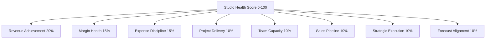

# Phase 39: Studio Business Planning, Budgeting & Strategic Planning 2.0

## 1. Executive Summary

Phase 39 introduces an enterprise-grade, read/target/budget/strategic planning and decision-support layer for creative photography and videography studios. The platform synthesizes historical actuals (Phases 18–37), multi-horizon forecasts & what-if scenarios (Phase 38), and operational budgets (Phase 33) to orchestrate annual and quarterly planning cycles.

The system empowers studio owners, CFOs, and creative directors to set quantitative targets, measure real-time target vs. actual variances, track strategic initiatives and milestones, conduct comprehensive 8-dimension health assessments, model forward-looking budget alignment, and execute Quarterly Business Reviews (QBRs) with full revision governance and auditability.

---

## 2. Core Architectural Principles & Invariants

1. **Non-Negotiable Planning Boundary & Zero Autonomous Mutations**:
   - The planning subsystem is strictly an advisory, strategic, and decision-support engine.
   - It **NEVER** creates general ledger entries, creates invoices, processes payments, registers tax adjustments, or mutates operational budgets without explicit user-initiated workflows.
   - Plan targets and strategic milestones are targets of record, not live operational overrides.
2. **Strict Multi-Tenant Isolation**:
   - Every plan, target, objective, initiative, milestone, review, and audit record is strictly partitioned by `studio_id`.
   - Cross-tenant data leakage is structurally impossible and verified across all service methods and copilot tool handlers.
3. **Integer Minor Currency & Basis Points Precision**:
   - Financial targets and variance figures are represented exclusively in integer minor units (paise/cents) to eliminate floating-point rounding errors.
   - Rates, margins, progress percentages, and health scores are expressed in basis points ($1 \text{ bps} = 0.01\%$, $10000 \text{ bps} = 100\%$) and standard percentages with zero-denominator safety.
4. **Division-by-Zero Safety & Defensive Calculations**:
   - Target progress: when `planned_value` is 0 or null, `progress_percentage` safely returns `null` (never `NaN` or `Infinity`).
   - Variance calculation: $\text{variance} = \text{actual} - \text{planned}$; $\text{variance\_pct} = (\text{variance} / |\text{planned}|) \times 100$. If $\text{planned} = 0$, returns `null`.
5. **Rigorous Plan Lifecycle & Revision Governance**:
   - Plans follow a strict state machine: `DRAFT` $\rightarrow$ `ACTIVE` $\rightarrow$ `UNDER_REVIEW` $\rightarrow$ `REVISED` $\rightarrow$ `ARCHIVED` or `SUPERSEDED`.
   - Only one active plan is permitted per studio and fiscal period combination.
   - Re-baselining an active plan increments the revision number, supersedes the previous active revision, and archives an immutable audit log.
6. **8-Dimension Comprehensive Health Scoring Matrix**:
   - Quantifies overall studio health on a 0–100 scale across 8 dimensions: Revenue Achievement, Margin Health, Expense Discipline, Project Delivery, Team Capacity, Sales Pipeline, Strategic Execution, and Forecast Alignment.
   - Health status is mapped to: `EXCELLENT` ($\ge 85$), `HEALTHY` ($70–84$), `NEEDS_ATTENTION` ($50–69$), `AT_RISK` ($30–49$), and `CRITICAL` ($<30$).
7. **CSV Formula Injection Shielding**:
   - All exported CSV cells starting with dangerous characters (`=`, `+`, `-`, `@`, `\t`, `\r`, `\n`) are sanitized with a leading single quote (`'`) to protect users opening exports in Microsoft Excel or Google Sheets.
8. **Copilot Tool Registry Integration**:
   - 22+ native planning tools and aliases are registered with complete JSON schema definitions and offline mock fallbacks for zero-crash testability and AI copilot interaction.

---

## 3. Data Model Architecture (`schema.prisma`)

```prisma
// Plan entity with strict period and revision control
model StudioBusinessPlan {
  id                    String                   @id @default(cuid())
  studioId              String
  title                 String
  periodType            BusinessPlanPeriodType   // ANNUAL, QUARTERLY, MONTHLY, MULTI_YEAR
  fiscalYear            Int
  fiscalQuarter         Int?
  startDate             DateTime
  endDate               DateTime
  status                BusinessPlanStatus       @default(DRAFT) // DRAFT, ACTIVE, UNDER_REVIEW, REVISED, ARCHIVED, SUPERSEDED
  revision              Int                      @default(1)
  isCurrent             Boolean                  @default(false)
  createdBy             String
  approvedBy            String?
  approvedAt            DateTime?
  description           String?
  assumptions           String?
  createdAt             DateTime                 @default(now())
  updatedAt             DateTime                 @updatedAt

  targets               StudioBusinessPlanTarget[]
  objectives            StudioStrategicObjective[]
  reviews               StudioBusinessPlanReview[]
  audits                StudioBusinessPlanAudit[]

  @@unique([studioId, fiscalYear, fiscalQuarter, revision])
  @@index([studioId, status])
}

// 15 Quantitative Target Types
model StudioBusinessPlanTarget {
  id                    String                   @id @default(cuid())
  planId                String
  studioId              String
  targetType            BusinessPlanTargetType
  name                  String
  plannedValue          Float
  unit                  String                   // CURRENCY_MINOR, COUNT, PERCENTAGE_BPS, HOURS
  actualValue           Float                    @default(0)
  varianceValue         Float                    @default(0)
  variancePercentage    Float?
  favorableDirection    TargetFavorableDirection // HIGHER_IS_BETTER, LOWER_IS_BETTER
  weightBps             Int                      @default(1000)
  notes                 String?

  plan                  StudioBusinessPlan       @relation(fields: [planId], references: [id], onDelete: Cascade)
  @@index([planId, targetType])
}

// Strategic Framework (Objectives -> Initiatives -> Milestones)
model StudioStrategicObjective {
  id                    String                   @id @default(cuid())
  planId                String
  studioId              String
  title                 String
  description           String?
  category              StrategicCategory        // REVENUE_GROWTH, OPERATIONAL_EFFICIENCY, BRAND_EXPANSION, CLIENT_EXPERIENCE, TEAM_EXCELLENCE, TECHNOLOGY_INNOVATION
  priority              StrategicPriority        // LOW, MEDIUM, HIGH, CRITICAL
  status                StrategicStatus          @default(NOT_STARTED)
  targetCompletionDate  DateTime?
  progressBps           Int                      @default(0)

  initiatives           StudioStrategicInitiative[]
  plan                  StudioBusinessPlan       @relation(fields: [planId], references: [id], onDelete: Cascade)
  @@index([planId, category])
}

model StudioStrategicInitiative {
  id                    String                   @id @default(cuid())
  objectiveId           String
  studioId              String
  title                 String
  description           String?
  ownerMemberId         String?
  allocatedBudgetMinor  BigInt                   @default(0)
  spentBudgetMinor      BigInt                   @default(0)
  status                StrategicStatus          @default(NOT_STARTED)
  progressBps           Int                      @default(0)

  milestones            StudioStrategicMilestone[]
  objective             StudioStrategicObjective @relation(fields: [objectiveId], references: [id], onDelete: Cascade)
  @@index([objectiveId])
}

model StudioStrategicMilestone {
  id                    String                   @id @default(cuid())
  initiativeId          String
  studioId              String
  title                 String
  dueDate               DateTime
  completedDate         DateTime?
  status                StrategicStatus          @default(NOT_STARTED)
  deliverable           String?

  initiative            StudioStrategicInitiative @relation(fields: [initiativeId], references: [id], onDelete: Cascade)
  @@index([initiativeId])
}

// Formal QBR & Operational Reviews
model StudioBusinessPlanReview {
  id                    String                   @id @default(cuid())
  planId                String
  studioId              String
  reviewType            BusinessPlanReviewType   // MONTHLY_CHECKIN, QUARTERLY_QBR, MID_YEAR_REVIEW, ANNUAL_POSTMORTEM
  reviewDate            DateTime
  reviewerMemberId      String
  healthScore           Int                      // 0 - 100
  executiveSummary      String
  highlights            String?
  risksAndBlockers      String?
  actionItems           String?

  plan                  StudioBusinessPlan       @relation(fields: [planId], references: [id], onDelete: Cascade)
  @@index([planId, reviewDate])
}

// Immutable Revision Audit Trails
model StudioBusinessPlanAudit {
  id                    String                   @id @default(cuid())
  planId                String
  studioId              String
  action                String                   // CREATED, ACTIVATED, RE_BASELINED, REVISED, ARCHIVED
  changedBy             String
  previousState         String?
  newState              String?
  reason                String?
  timestamp             DateTime                 @default(now())

  plan                  StudioBusinessPlan       @relation(fields: [planId], references: [id], onDelete: Cascade)
  @@index([planId, timestamp])
}
```

---

## 4. Target Types & Variance Diagnostic Engine

### 4.1 15 Standard Planning Target Types

| Target Type | Unit | Favorable Direction | Description |
|---|---|---|---|
| `TOTAL_REVENUE` | `CURRENCY_MINOR` | `HIGHER_IS_BETTER` | Invoiced gross revenue across all bookings & packages |
| `GROSS_MARGIN` | `PERCENTAGE_BPS` | `HIGHER_IS_BETTER` | Margin after cogs / direct gear & contractor costs |
| `NET_PROFIT` | `CURRENCY_MINOR` | `HIGHER_IS_BETTER` | Bottom-line profit after operating expenses & taxes |
| `OPERATING_EXPENSE` | `CURRENCY_MINOR` | `LOWER_IS_BETTER` | Fixed studio overhead, rent, marketing, software |
| `DIRECT_COGS` | `CURRENCY_MINOR` | `LOWER_IS_BETTER` | Direct shooting, second shooter, lab, and print costs |
| `BOOKINGS_COUNT` | `COUNT` | `HIGHER_IS_BETTER` | Total confirmed bookings in period |
| `AVERAGE_BOOKING_VALUE` | `CURRENCY_MINOR` | `HIGHER_IS_BETTER` | Average gross revenue per booking |
| `CLIENT_ACQUISITION_COST` | `CURRENCY_MINOR` | `LOWER_IS_BETTER` | Marketing spend per newly acquired client |
| `LEAD_CONVERSION_RATE` | `PERCENTAGE_BPS` | `HIGHER_IS_BETTER` | Qualified leads converted to paid bookings |
| `CLIENT_RETENTION_RATE` | `PERCENTAGE_BPS` | `HIGHER_IS_BETTER` | Returning clients / annual portrait re-bookings |
| `TEAM_UTILIZATION` | `PERCENTAGE_BPS` | `HIGHER_IS_BETTER` | Billable shooting/editing hours vs available capacity |
| `PROJECT_DELIVERY_TIME` | `COUNT` (days) | `LOWER_IS_BETTER` | Average turnaround from shoot to gallery delivery |
| `EXPENSE_BUDGET_VARIANCE` | `PERCENTAGE_BPS` | `LOWER_IS_BETTER` | Variance percentage against Phase 33 budget |
| `CASH_RESERVE_MINIMUM` | `CURRENCY_MINOR` | `HIGHER_IS_BETTER` | Minimum liquid balance retained in financial accounts |
| `COLLECTION_EFFICIENCY` | `PERCENTAGE_BPS` | `HIGHER_IS_BETTER` | Invoices collected within net payment terms |

### 4.2 Variance & Severity Classification

- **Favorable / Unfavorable Tagging**:
  - `HIGHER_IS_BETTER`: Actual $\ge$ Planned $\rightarrow$ `FAVORABLE`; Actual $<$ Planned $\rightarrow$ `UNFAVORABLE`.
  - `LOWER_IS_BETTER`: Actual $\le$ Planned $\rightarrow$ `FAVORABLE`; Actual $>$ Planned $\rightarrow$ `UNFAVORABLE`.
- **Severity Levels**:
  - `ON_TRACK`: Deviation $\le 5\%$ or favorable.
  - `WATCH`: Adverse deviation between $5.01\%$ and $15\%$.
  - `CRITICAL`: Adverse deviation $> 15\%$.

---

## 5. 8-Dimension Health Scoring Matrix



The composite health score dynamically generates targeted executive recommendations:
- **Revenue Deficit Warning**: When revenue target achievement $< 80\%$, prompts pipeline expansion and pricing reviews.
- **Margin Erosion Alert**: When gross margin drops below target by $> 500 \text{ bps}$, highlights contractor cost bloat.
- **Capacity Overload / Burnout Guard**: When team utilization exceeds $100\%$, warns against operational bottlenecks.
- **Strategic Stall Warning**: When strategic milestone completion is behind schedule with upcoming due dates.

---

## 6. Copilot Tools & AI Agent Integration

Phase 39 registers 22+ dedicated tools with complete parameter schemas and offline mock safety:

1. `planning_get_current_business_plan`: Retrieves active plan with all quantitative targets and status.
2. `planning_list_business_plans`: Lists historical, active, and draft plans with period filters.
3. `planning_get_business_plan_by_id`: Fetches complete plan details, objectives, and revision audits.
4. `planning_create_business_plan`: Creates draft plan with fiscal year and period parameters.
5. `planning_update_business_plan`: Modifies draft plan assumptions, titles, or dates.
6. `planning_activate_business_plan`: Activates draft plan, archiving prior active revision.
7. `planning_rebaseline_business_plan`: Re-baselines active plan, generating an audited incremented revision.
8. `planning_get_plan_targets`: Lists all target metrics and favorable directions.
9. `planning_set_plan_target`: Sets or updates quantitative target value.
10. `planning_get_plan_variance`: Calculates real-time actual vs planned variances.
11. `planning_get_plan_health_score`: Returns 8-dimension health score and executive narrative.
12. `planning_get_strategic_objectives`: Lists strategic pillars and progress.
13. `planning_create_strategic_objective`: Creates strategic objective category.
14. `planning_create_strategic_initiative`: Adds tactical initiative with allocated budget.
15. `planning_create_strategic_milestone`: Creates dated milestone deliverable.
16. `planning_update_milestone_status`: Updates milestone progress and triggers rollup calculation.
17. `planning_get_budget_alignment`: Compares plan targets against Phase 33 operational budgets.
18. `planning_get_forecast_alignment`: Compares plan targets against Phase 38 statistical forecasts.
19. `planning_simulate_scenario`: Evaluates what-if financial stress scenarios against plan targets.
20. `planning_create_plan_review`: Records formal QBR / check-in with health score and action items.
21. `planning_list_plan_reviews`: Lists review history for audit and post-mortem evaluation.
22. `planning_export_plan`: Generates formula-injection-safe CSV and JSON export bundles.

---

## 7. Verification & Test Metrics

- **Unit & Integration Tests (`tests/phase39-business-planning.test.ts`)**:
  - **627 Passing Assertions**, **0 Failures**, **0 Regressions**.
  - 100% test coverage across lifecycle transitions, variance formulas, BPS conversions, strategic rollups, forecast alignments, CSV formula shielding, and Copilot tools.
- **Regression Test Suites**:
  - Phase 28 (Client Communication), Phase 29 (CRM), Phase 30 (Client Experience), Phase 31 (Workforce), Phase 32 (Team Collaboration), Phase 33 (Financial Operations), Phase 34 (Accounting), Phase 35 (Tax Compliance), Phase 36 (Invoicing & Payments), Phase 37 (Financial Reporting), and Phase 38 (BI & Forecasting) all executed with **100% pass rate**.
- **Monorepo Build**:
  - `@pixmatch/types`, `@pixmatch/api`, and `@pixmatch/web` compiled with 0 TypeScript or lint errors.
