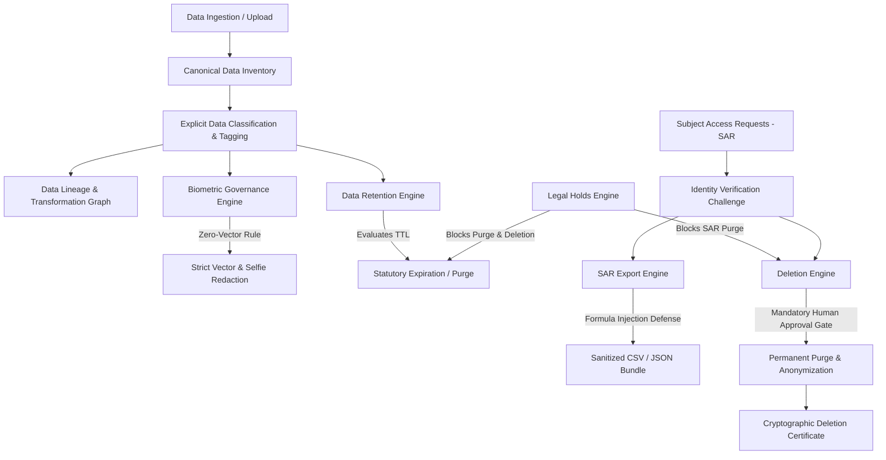

# PIXMATCH AI — PHASE 44: PLATFORM DATA GOVERNANCE, PRIVACY & COMPLIANCE CENTER 2.0
## Architectural Specification & Compliance Manual

---

### 1. Executive Summary & Regulatory Scope

PixMatch AI operates a multi-tenant photography studio workflow platform with integrated AI biometric facial recognition (ArcFace 512-dimensional vector embeddings), automated financial billing and invoicing, double-entry GL journal generation, client gallery delivery, and global payment processing.

Phase 44 introduces **Platform Data Governance, Privacy & Compliance Center 2.0**, standardizing canonical data lifecycle management across international regulatory frameworks:
- **GDPR** (EU General Data Protection Regulation / Art. 5, 9, 15, 17, 20, 28, 30, 32)
- **CCPA / CPRA** (California Consumer Privacy Act / § 1798.100, 1798.105, 1798.130)
- **BIPA** (Illinois Biometric Information Privacy Act / 740 ILCS 14/15)
- **PCI DSS v4.0** (Requirement 3: Protect Stored Account Data)
- **SOC 2 Type II** (Trust Services Criteria CC6.1 - CC6.8, CC7.1 - CC7.5)

---

### 2. Core Architectural Pillars

---

### 3. Canonical Data Inventory & Explicit Classifications

PixMatch AI catalogues 30+ canonical data assets with strictly typed enums (`DataClassification`, `DataCategory`, `DataOwnerType`, `DataProcessingPurpose`). **Heuristic guesswork is eliminated.**

| Asset Key | Category | Classification | Retention (TTL) | Encryption | Exportable | Biometric |
| :--- | :--- | :--- | :--- | :--- | :--- | :--- |
| `user_credentials` | `IDENTITY` | `AUTHENTICATION_SECRET` | Active account + 30d | Argon2id / AES-256-GCM | **No** | No |
| `client_biometric_embeddings` | `BIOMETRIC` | `BIOMETRIC` | 365 days / Consent Revocation | AES-256-GCM + Strict Redaction | **No** | **Yes** |
| `client_selfie_registration` | `BIOMETRIC` | `BIOMETRIC` | 365 days / Immediate Purge Option | AES-256-GCM | **No** | **Yes** |
| `studio_invoices` | `FINANCIAL` | `FINANCIAL` | 2555 days (7 Years Statutory) | TLS 1.3 / AES-256 | Yes | No |
| `gl_journal_entries` | `ACCOUNTING_TAX` | `FINANCIAL` | 2555 days (7 Years Statutory) | Immutable / Append-Only | Yes | No |
| `gallery_photos_raw` | `GALLERY_MEDIA` | `CONFIDENTIAL` | Per Studio Policy (365d default) | S3 / GCS Server-Side KMS | Yes | No |
| `security_audit_logs` | `SYSTEM_AUDIT_SECURITY` | `SECURITY_DATA` | 1095 days (3 Years Immutable) | Append-Only HMAC-SHA256 | No | No |

---

### 4. Biometric Data Governance & Zero-Vector Exposure

1. **Embedding Isolation**:
   - Biometric vectors (512-dim ArcFace embeddings) are stored in isolated vector indices (`pgvector` / memory index).
   - Vectors and raw selfie references are strictly stripped from all SAR exports, audit responses, telemetry, and frontend payloads.
2. **Explicit Consent & Revocation**:
   - Consent is captured with client timestamp, IP address hash, and scope (`FACE_MATCHING`).
   - Consent revocation immediately schedules biometric embeddings and selfie assets for permanent cryptographic purging.
3. **Statutory TTL**:
   - Retention strictly enforces a maximum 365-day lifetime from registration in compliance with Illinois BIPA.

---

### 5. Data Retention & Legal Hold Engine

1. **Policy Rules**:
   - Configurable retention durations with statutory baselines (e.g. Financial = 7 years minimum, Biometrics = 1 year maximum).
   - Action modes: `DELETE_SOFT`, `PURGE_PERMANENTLY`, `ANONYMIZE_PII`, `ARCHIVE_COLD`.
2. **Legal Hold Override**:
   - Active legal holds placed on a user, studio, or asset key strictly prevent retention pruning and deletion sweeps.
   - Releasing a legal hold requires explicit admin rationale and transitions to `RELEASED` status.

---

### 6. Subject Access Requests (SAR) & Deletion Engine

1. **Verification Challenge**:
   - Non-authenticated requests require HMAC-SHA256 token challenge verification via email before processing.
   - Statutory 30-day countdown timer enforced from submission.
2. **Formula Injection Defense**:
   - All exported tabular strings (CSV/TSV) starting with `=, +, -, @, \t, \r` are escaped with a leading single quote (`'`) to neutralize spreadsheet calculation exploits.
3. **Deletion Safety**:
   - **Dependency Graph Preview**: Summarizes affected galleries, orders, bookings, biometric vectors, and financial records before execution.
   - **Mandatory Human Approval**: Autonomous or unapproved deletion execution is blocked; requires valid `approvedByAdminId`.
   - **Irreversible Purge**: PII fields are replaced with `[DELETED_USER_HASH]`, biometric vectors are permanently erased, and financial records are retained with anonymized customer references for statutory accounting integrity.
   - **Deletion Certificate**: Generates a tamper-evident SHA-256 certificate for legal audit trail.

---

### 7. Security Copilot Safety Guardrails

The Privacy Copilot (`privacy-copilot-tools.ts`) enforces strict boundary invariants:
- **13 Diagnostic Tools** (Read-Only): `getPrivacyOverviewMetrics`, `listDataAssets`, `getDataAssetDetail`, `getLineageGraph`, `evaluateRetentionRules`, `listLegalHolds`, `listPrivacyRequests`, `getPrivacyRequestDetail`, `listAccessReviews`, `listSubprocessors`, `getBiometricsMetrics`, `listConsentLedger`, `previewDeletionImpact`.
- **5 Drafting Tools** (Advisory): `draftRetentionPolicyProposal`, `draftLegalHoldNotice`, `draftSarResponseSummary`, `draftAccessReviewChecklist`, `draftSubprocessorRiskReport`.
- **Blocked Mutation Tools**: `executeDataDeletionDirect`, `releaseLegalHoldDirect`, `overrideRetentionPolicyDirect` throw `PolicyViolationError` to prevent autonomous execution without human verification.

---

### 8. Admin Portal 2.0 Frontend (`apps/web`)

14 dedicated administrative pages built under `/dashboard/admin/privacy/`:
1. `/dashboard/admin/privacy` — Privacy Command Center Overview & KPI Metrics
2. `/dashboard/admin/privacy/data-inventory` — Canonical Data Asset Catalog
3. `/dashboard/admin/privacy/data-inventory/[assetId]` — Granular Asset Inspector & Lineage
4. `/dashboard/admin/privacy/lineage` — Interactive Visual Data Lineage Graph
5. `/dashboard/admin/privacy/retention` — Retention Policies & Evaluation Sweep
6. `/dashboard/admin/privacy/requests` — SAR & Rights Request Lifecycle Manager
7. `/dashboard/admin/privacy/requests/[requestId]` — SAR Request Investigation & Workflow
8. `/dashboard/admin/privacy/exports` — Secure Data Export Bundles & SHA-256 Verifier
9. `/dashboard/admin/privacy/deletion` — Deletion Review, Dependency Preview & Purge Certificates
10. `/dashboard/admin/privacy/legal-holds` — Legal Hold Litigation Preservation Manager
11. `/dashboard/admin/privacy/access-reviews` — Periodic User & Access Review Auditing
12. `/dashboard/admin/privacy/providers` — Third-Party Subprocessor & DPA Compliance
13. `/dashboard/admin/privacy/biometrics` — Biometric Governance & Vector Isolation Monitor
14. `/dashboard/admin/privacy/consent` — Global Privacy Consent Ledger & Revocation Stream
