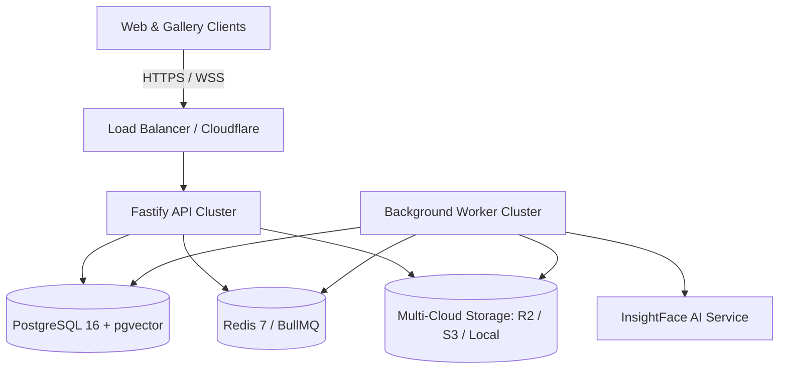

# PIXMATCH AI — PRODUCTION RECOVERY & DISASTER RUNBOOK

## 1. Overview & System Topology
PixMatch AI operates as a resilient multi-tenant architecture designed to maintain high availability and prevent data loss during underlying infrastructure or third-party service outages.



---

## 2. PostgreSQL Disaster Recovery & Backup Strategy

### A. Logical Backups (Nightly)
- **Tool**: `pg_dump` with custom compressed format (`-Fc`).
- **Command**:
  ```bash
  pg_dump -h $DB_HOST -U $DB_USER -d $DB_NAME -Fc -f /backups/pixmatch_$(date +%Y%m%d_%H%M%S).dump
  ```
- **Retention**: 30 days locally, replicated to immutable secondary S3 bucket.

### B. Point-in-Time Recovery (PITR) & Continuous Archiving
- WAL (Write-Ahead Logging) archiving enabled (`wal_level = replica`, `archive_mode = on`).
- WAL segments continuously shipped to offsite backup storage.
- Recovery Target: Point-in-time timestamp down to the second of failure:
  ```sql
  restore_command = 'aws s3 cp s3://pixmatch-wal-backups/%f %p'
  recovery_target_time = '2026-09-13 14:30:00 UTC'
  ```

### C. Database Restoration Procedure
1. Stand up new PostgreSQL instance with identical pgvector extension (`CREATE EXTENSION IF NOT EXISTS vector;`).
2. Run database migrations:
   ```bash
   npm run db:push --workspace=@pixmatch/database
   ```
3. Restore data dump:
   ```bash
   pg_restore -h $NEW_DB_HOST -U $DB_USER -d $DB_NAME -v /backups/pixmatch_target.dump
   ```

---

## 3. Redis & BullMQ Queue Resilience

### A. Redis Persistence
- **AOF (Append Only File)** enabled with `appendfsync everysec`.
- **RDB Snapshots** every 15 minutes (`save 900 1`).
- **Eviction Policy**: `noeviction` on queue databases (db 0) to prevent dropping background processing jobs.

### B. Worker Crash & Job Recovery
- BullMQ uses deterministic job IDs (e.g. `photo-proc-${photoId}`, `sync-${connectionId}-${jobId}`).
- When a worker crashes mid-processing:
  - The job lock automatically expires after 30 seconds.
  - The stalled job checker on active workers detects the orphaned job and marks it for backoff retry.
  - Maximum retries configured to 3 with exponential backoff (`attempts: 3, backoff: { type: 'exponential', delay: 2000 }`).

---

## 4. Object Storage & Asset Preservation

### A. Storage Architecture
- Original and processed photos stored in primary storage (Cloudflare R2 / AWS S3 / Local).
- Master photo derivatives (thumbnail, display, watermarked) are deterministic and reproducible from originals.

### B. Storage Provider Outage Failover
1. If connected cloud storage (Google Drive / Dropbox / OneDrive) experiences a rate limit or outage, the sync processor flags the job as `FAILED` with a human-readable reason (`RATE_LIMIT_EXCEEDED` / `STORAGE_UNAVAILABLE`) and queues a retry.
2. The database state remains uncorrupted (`ProcessingStatus.FAILED`).

---

## 5. Storage Token & Credential Encryption Recovery

- Storage credentials (OAuth tokens, S3 secret keys) are encrypted using AES-256-GCM.
- Ciphertext format: `v1:<iv_hex>:<tag_hex>:<ciphertext_hex>`.
- Master key: `STORAGE_ENCRYPTION_KEY` (32-byte hex).
- **Key Rotation Runbook**:
  1. Set `STORAGE_ENCRYPTION_KEY_PREVIOUS` to old key and `STORAGE_ENCRYPTION_KEY` to new key.
  2. Run re-encryption migration script to cycle all stored tokens to new key with `v1:` tag.
  3. Decommission old key.

---

## 6. AI Service (InsightFace) Failure Runbook

1. If the Python AI service crashes or times out:
   - Worker catches HTTP error / timeout without terminating the worker daemon.
   - Sets `Photo.processing_status = 'FAILED'`.
   - Leaves zero partial or corrupt `FaceDetection` rows in PostgreSQL.
2. Upon AI service restart:
   - Photographers can trigger single or bulk photo re-indexing (`POST /api/v1/galleries/:id/photos/bulk-action` with action `REINDEX`).
   - The queue processor re-extracts 512-d embeddings and updates pgvector tables seamlessly.
